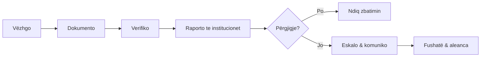

# Aktivizmi

Nga një shqetësim mjedisor te një çështje e dokumentuar dhe e koordinuar. Kjo pjesë është për qytetarë, grupe dhe organizata që duan të veprojnë **me fakte, brenda ligjit dhe me kujdes për njerëzit**.

## Rruga e veprimit

## Zgjidh pikën ku je

-   :material-camera-outline:{ .lg .middle } **1. Dokumento**

    Çfarë të mbledhësh në terren dhe si ta ruash që të merret seriozisht.

    [:octicons-arrow-right-24: Dokumento një problem](dokumento.md)

-   :material-file-document-edit-outline:{ .lg .middle } **2. Raporto**

    Kujt t'i drejtohesh dhe si ta shkruash një ankesë efektive.

    [:octicons-arrow-right-24: Raporto te institucionet](raporto.md)

-   :material-file-search-outline:{ .lg .middle } **3. Kërko informacion**

    Kërko lejet, planet dhe raportet që institucionet duhet t'i japin.

    [:octicons-arrow-right-24: Kërko informacion publik](informim.md)

-   :material-forum-outline:{ .lg .middle } **4. Merr pjesë**

    Komento në konsultime publike dhe në VNM para se vendimi të merret.

    [:octicons-arrow-right-24: Pjesëmarrja në vendimmarrje](pjesemarrje.md)

-   :material-account-group-outline:{ .lg .middle } **5. Organizo**

    Ndërto një kërkesë të qartë, aleanca dhe një plan.

    [:octicons-arrow-right-24: Organizo një fushatë](fushata.md)

-   :material-bullhorn-outline:{ .lg .middle } **6. Komuniko**

    Tregoje historinë me fakte, burime dhe kërkesë të qartë.

    [:octicons-arrow-right-24: Komuniko me publikun](komuniko.md)

-   :material-shield-account-outline:{ .lg .middle } **Siguria**

    Rreziqet dhe si t'i ulësh, për ty dhe për burimet.

    [:octicons-arrow-right-24: Siguria e aktivistëve](siguria.md)

-   :material-book-open-page-variant-outline:{ .lg .middle } **Raste studimore**

    Çfarë funksionoi (dhe çfarë jo) në raste të mëparshme.

    [:octicons-arrow-right-24: Rasti Vjosa](raste/vjosa.md)

!!! tip "Parimi bazë"
    Ndaje qartë atë që ke parë, atë që mund të provosh dhe atë që ende kërkon verifikim.

!!! warning "Mos ndërhy vetë"
    Mos ndërhy fizikisht kundër gjuetarëve, prerësve ose ndërtuesve. Dokumento, largohu dhe njofto autoritetet. Një vëzhgim i sigurt vlen më shumë se një konfrontim i rrezikshëm.
