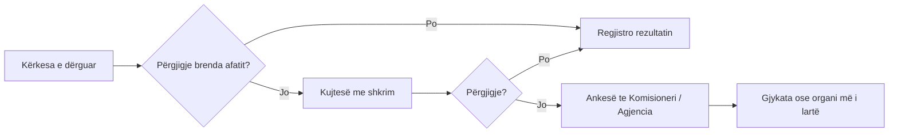

# Kërko informacion publik

Institucionet mbajnë leje, plane menaxhimi, raporte monitorimi dhe VNM. Shumë prej tyre janë **publike me ligj**; duhet vetëm t'i kërkosh saktë.

<div class="ib-glance">
<div><strong>Për kë</strong>Çdo qytetar ose organizatë; nuk jep arsye</div>
<div><strong>Të duhet</strong>Emri i institucionit, vendi dhe periudha</div>
<div><strong>Del</strong>Dokumente me shkrim ose refuzim i arsyetuar</div>
</div>

## Baza ligjore

<div class="grid cards ib-compact" markdown>

-   :material-flag-outline:{ .lg .middle } **Shqipëri**

    Ligji nr. 119/2014 "Për të drejtën e informimit" dhe Konventa e Aarhusit.

-   :material-flag-outline:{ .lg .middle } **Kosovë**

    Ligji nr. 06/L-081 "Për qasje në dokumente publike".

</div>

Verifiko numrin dhe versionin në fuqi: [Ligjet & institucionet](../baza/ligje-institucione.md).

## Çfarë mund të kërkosh

<div class="grid cards ib-compact" markdown>

-   :material-file-certificate-outline:{ .lg .middle } **Leje**

    Mjedisore, ndërtimi dhe shfrytëzimi për një vend.

-   :material-leaf-circle-outline:{ .lg .middle } **VNM**

    Vlerësimi i Ndikimit në Mjedis dhe vendimet mbi të.

-   :material-clipboard-list-outline:{ .lg .middle } **Plane menaxhimi**

    Për një zonë të mbrojtur.

-   :material-magnify-scan:{ .lg .middle } **Raporte**

    Inspektimi dhe monitorimi.

-   :material-handshake-outline:{ .lg .middle } **Kontrata**

    Koncesione që prekin burime natyrore.

-   :material-vector-polygon:{ .lg .middle } **Të dhëna hapësinore**

    Zonimi dhe kufijtë zyrtarë në format digjital.

</div>

## Si ta shkruash kërkesën

<div class="ib-steps" markdown>

1. **Adresoje te Koordinatori për të drejtën e informimit** (ose përgjegjësi përkatës) i institucionit.
2. **Bëje specifike:** cilat dokumente, për cilin vend, për cilën periudhë.
3. **Kërko formatin:** kopje elektronike.
4. **Cito ligjin** dhe kërko përgjigje me shkrim brenda afatit ligjor.
5. **Mos jep arsye.** Nuk je i detyruar të shpjegosh pse e kërkon.
6. **Ruaj provën e dërgimit.**

</div>

## Modelet e emailit

=== "1. Kërkesa"

    ```text
    Për:      Koordinatori për të Drejtën e Informimit, [Institucioni]
    Lënda:    Kërkesë për informacion: [tema], [vendi/zona]

    I nderuar/e nderuar Koordinator,

    1. BAZA LIGJORE
       Sipas [ligjit nr. …, neni …] dhe Konventës së Aarhusit, kërkoj
       kopje elektronike të dokumenteve të mëposhtme.

    2. DOKUMENTET E KËRKUARA
       a) Lejen/lejet e lëshuara për [veprimtaria] në [vendndodhja / koordinatat],
          nga [data] deri sot.
       b) Vlerësimin e Ndikimit në Mjedis dhe vendimin përkatës.
       c) Raportet e inspektimit për të njëjtën vendndodhje.

    3. FORMATI
       Kopje elektronike (PDF ose format i hapur), në këtë adresë emaili.

    4. AFATI
       Kërkoj përgjigje me shkrim brenda afatit ligjor.
       Në rast refuzimi të pjesshëm ose të plotë, kërkoj arsyetim me shkrim
       dhe udhëzim për apelim.

    Me respekt,
    [Emri, adresa/email, data]
    ```

=== "2. Kujtesë"

    ```text
    Për:      Koordinatori për të Drejtën e Informimit, [Institucioni]
    Lënda:    Kujtesë: kërkesa e [data], nr. protokolli [numri]

    I nderuar/e nderuar Koordinator,

    Më [data] dërgova një kërkesë për informacion (nr. protokolli [numri])
    lidhur me [tema]. Afati ligjor i përgjigjes ka kaluar më [data].

    Kërkoj që dokumentet të më jepen brenda [numri ditësh] ose të më njoftohet
    me shkrim arsyeja e refuzimit. Në të kundërt, do t'i drejtohem
    [Komisionerit / Agjencisë së Informimit].

    Bashkëlidhur: kërkesa origjinale dhe prova e dërgimit.

    Me respekt,
    [Emri, kontakti]
    ```

=== "3. Ankesë për refuzim"

    ```text
    Për:      [Komisioneri për të Drejtën e Informimit / Agjencia e Informimit dhe Privatësisë]
    Lënda:    Ankesë për refuzim ose mospërgjigje: [institucioni], [data]

    I nderuar/e nderuar [Titulli],

    1. KËRKESA
       Më [data] i kërkova [institucioni] dokumentet: [lista e shkurtër].
       Nr. protokolli: [numri]. Kopja bashkëlidhur.

    2. PËRGJIGJA
       [ ] Nuk kam marrë përgjigje brenda afatit ligjor.
       [ ] Kërkesa u refuzua më [data], me këtë arsyetim: [përmbledhje].
       [ ] Refuzimi nuk është i arsyetuar ose nuk tregon udhëzim për apelim.

    3. PSE REFUZIMI NUK MBAHET
       [Një deri dy fjali: p.sh. dokumentet janë informacion mjedisor; nuk
       vlen përjashtimi i cituar; jepet vetëm një pjesë e kërkuar.]

    4. KËRKESA IME
       Kërkoj që [institucioni] të detyrohet të japë dokumentet e kërkuara.

    Bashkëlidhur: (1) kërkesa origjinale; (2) prova e dërgimit;
    (3) kujtesa; (4) përgjigja ose refuzimi.

    Me respekt,
    [Emri, kontakti]
    ```

## Nëse refuzojnë ose heshtin



- **Regjistro datën** kur kalon afati.
- Nëse duhet, kërko ndihmë nga organizatat: [Organizata & rrjete](../rekomandime/organizata.md).

!!! note "Refuzimi është vetë një fakt"
    Kur merr përgjigje ose refuzim, shtoje te regjistri i rastit. Një refuzim i pajustifikuar mund ta përdorësh.
