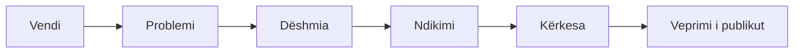

# Komuniko me publikun

Tregoje historinë me fakte, burime dhe një kërkesë të qartë.

## Struktura e mesazhit

## Lista para publikimit

- [ ] Çdo pretendim lidhet me burimin.
- [ ] Data dhe kufizimet e të dhënave janë shënuar.
- [ ] Emrat, shifrat dhe citimet janë kontrolluar.
- [ ] Opinioni dallohet nga fakti, pasiguria nga përfundimi.
- [ ] Figurat kanë tekst alternativ dhe videot kanë titra.
- [ ] Nuk zbulohen burime, vendndodhje të ndjeshme ose fytyra pa pëlqim.

## Pas publikimit

-   :material-page-layout-header:{ .lg .middle } **Një faqe bazë**

    E përditësuar; postimet e shkurtra drejtojnë te burimi i plotë.

-   :material-pencil-circle-outline:{ .lg .middle } **Korrigjime të hapura**

    Ruaji dhe shënoji publikisht.

-   :material-chart-timeline-variant:{ .lg .middle } **Mat rezultatin**

    Përgjigjet institucionale, pjesëmarrja dhe ndryshimet konkrete.

## Shih edhe

- [Verifikim & arkivim](../rekomandime/verifikim.md) para publikimit.
- [Siguria e aktivistëve](siguria.md) për mbrojtjen e burimeve.
