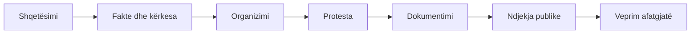

# Flamingo

Protesta nuk është vetëm një tubim. Ajo mund të lidhë një shqetësim të dokumentuar me organizimin qytetar, komunikimin publik, solidaritetin dhe presionin e vazhdueshëm për llogaridhënie.

Kjo është faqja kryesore e protestave brenda seksionit **Aktivizmi**. Mbështetet te përvoja dhe mjetet e publikuara nga [Revolucioni Flamingo](https://www.flamingorevolution.eu/), një bashkësi vullnetare që e përshkruan punën e vet përmes tri shtyllave: **zëri qytetar, projektet konkrete dhe dokumentimi**.

## Nga reagimi te veprimi

-   :material-account-voice:{ .lg .middle } **Organizo një protestë**

    ---

    Qëllimi, kërkesa, ekipi, siguria, komunikimi dhe ndjekja.

    [:octicons-arrow-right-24: Udhëzuesi praktik](organizimi.md)

-   :material-camera-marker-outline:{ .lg .middle } **Dokumento protestën**

    ---

    Kronologji, burime, fotografi, harta dhe të dhëna që mbeten të verifikueshme.

    [:octicons-arrow-right-24: Dokumentimi](dokumentimi.md)

-   :material-earth:{ .lg .middle } **Diaspora**

    ---

    Koordinim në qytete të ndryshme pa humbur kërkesën dhe burimin e përbashkët.

    [:octicons-arrow-right-24: Veprimi në diasporë](diaspora.md)

!!! tip "Rastet konkrete"
    Vendet e ciklit të protestave (Rrjolli, Zvërnec, Sazan, Dardhë, Kakomë, Nikaj-Mërtur, Theth), me kronologji, burime dhe çfarë mbetet e paqartë, shfaqen te **Dosje** në [hartë](../../../map/).

## Pesë parime

-   :material-dove:{ .lg .middle } **Paqësore**

    Njerëzit dhe siguria e tyre kanë përparësi.

-   :material-check-decagram-outline:{ .lg .middle } **E verifikueshme**

    Faktet ndahen nga pretendimet dhe burimet ruhen.

-   :material-lock-open-variant-outline:{ .lg .middle } **E hapur**

    Pjesëmarrësit mund të informohen, propozojnë dhe kontribuojnë.

-   :material-repeat:{ .lg .middle } **E vazhdueshme**

    Puna para dhe pas tubimit vlen aq sa prania në shesh.

-   :material-target:{ .lg .middle } **E lidhur me një kërkesë**

    Qartë çfarë kërkohet dhe kujt i drejtohet.

!!! info "Burimi kryesor"
    Për protestat, projektet dhe materialet e vetë lëvizjes, shih [flamingorevolution.eu](https://www.flamingorevolution.eu/) dhe faqen [Protestat Flamingo](https://www.flamingorevolution.eu/protestat/).
