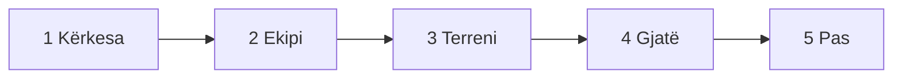

# Organizo një protestë paqësore

Një protestë bëhet mjet qytetar kur ka kërkesë, organizim dhe vazhdimësi. Flamingo Revolution e përshkruan kalimin nga energjia qytetare te **idetë, dokumentimi dhe veprimi i përbashkët**; ky udhëzues e kthen atë parim në hapa praktikë. [Burimi: Rreth nesh](https://www.flamingorevolution.eu/rreth-nesh/).

!!! warning "Kontrollo kërkesat ligjore"
    Rregullat për njoftimin, vendin, orarin dhe përgjegjësitë e organizatorëve ndryshojnë. Verifiko procedurën aktuale te autoriteti përgjegjës dhe kërko ndihmë juridike kur ka paqartësi. Kjo faqe nuk është këshillë ligjore.

## 1. Formulo kërkesën

Përcakto me një fjali:

-   :material-swap-horizontal:{ .lg .middle } **Çfarë**

    Çfarë duhet të ndryshojë.

-   :material-account-tie-outline:{ .lg .middle } **Kush**

    Kush ka kompetencën ta ndryshojë.

-   :material-calendar-clock-outline:{ .lg .middle } **Kur**

    Deri kur kërkohet përgjigjja.

-   :material-ruler:{ .lg .middle } **Si matet**

    Si do të matet rezultati.

## 2. Ndërto ekipin

| Roli | Përgjegjësia |
|---|---|
| **Koordinimi** | Orari, vendi, detyrat dhe partnerët |
| **Siguria** | Rreziqet, daljet, ndihma e parë dhe de-përshkallëzimi |
| **Aksesueshmëria** | Qasja, gjuha dhe nevojat praktike |
| **Kontakti ligjor** | Procedurat dhe ndihma juridike |

## 3. Përgatit terrenin

1. Kontrollo faktet dhe përgatit një përmbledhje me burime.
2. Zgjidh vendin, kohën dhe formatin sipas objektivit dhe kapacitetit.
3. Kryej procedurat e nevojshme.
4. Vlerëso motin, trafikun, turmën, kundërprotestën dhe emergjencat.
5. Cakto personat përgjegjës dhe një kanal komunikimi.
6. Informo pjesëmarrësit për natyrën paqësore dhe planin e sigurisë.

## 4. Gjatë protestës

-   :material-check-circle-outline:{ .lg .middle } **Bëj**

    ---

    - Mbaje mesazhin të thjeshtë dhe të verifikueshëm.
    - Ruaj rrugë të lira për emergjencat.
    - Dokumento nga një pozicion i sigurt.
    - Kujdesu fillimisht për njerëzit, pastaj për materialet.

-   :material-close-circle-outline:{ .lg .middle } **Mos bëj**

    ---

    - Mos u përfshi në provokime ose konfrontime.
    - Mos publiko fytyra pa pëlqim kur ekspozimi mund të krijojë rrezik.

## 5. Pas protestës

1. **Konfirmo sigurinë** e ekipit.
2. **Arkivo** materialet dhe komunikimet zyrtare.
3. **Publiko** çfarë ndodhi, çfarë u kërkua dhe cili është hapi i radhës.
4. **Dërgo kërkesën me shkrim** dhe cakto afatin e ndjekjes.
5. **Vlerëso** çfarë funksionoi dhe çfarë duhet ndryshuar.

Një ide qendrore e botimeve të Flamingo Revolution është se protesta fiton peshë kur kthehet në organizim që vazhdon përtej sheshit. Shih [Flamingo Times](https://www.flamingorevolution.eu/flamingo-times/).

## Lista e shpejtë

- [ ] Kërkesa dhe marrësi janë të qartë
- [ ] Faktet dhe burimet janë kontrolluar
- [ ] Procedurat aktuale janë verifikuar
- [ ] Rolet dhe kontaktet janë caktuar
- [ ] Ka plan sigurie, daljeje dhe ndihme të parë
- [ ] Ka plan dokumentimi dhe komunikimi
- [ ] Është përcaktuar hapi pas protestës
