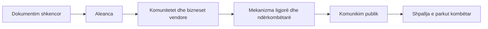

# Rasti Vjosa

Një nga rastet më të njohura të mbrojtjes së natyrës në rajon: **një lumë i egër që u shpall park kombëtar pas një fushate shumëvjeçare.**

## Në një shikim

<strong>Çështja</strong>Hidrocentrale të planifikuara në lumin kryesor dhe degët

<strong>Kërkesa</strong>Ruajtja e rrjedhës së lirë

<strong>Rezultati</strong>Park kombëtar, mars 2023

Vjosa është një nga lumenjtë e fundit të mëdhenj në Evropë që rrjedh pa diga në pjesën më të madhe të rrjedhës. Për vite me radhë u planifikuan hidrocentrale që do ta fragmentonin ekosistemin.

## Çfarë u bë

-   :material-microscope:{ .lg .middle } **Dokumentim shkencor**

    Studime të biodiversitetit dhe ekosistemit që treguan vlerën e pazakontë të lumit.

-   :material-handshake-outline:{ .lg .middle } **Aleanca**

    Organizata shqiptare dhe ndërkombëtare, si fushata *Save the Blue Heart of Europe*, me EcoAlbania, Riverwatch dhe EuroNatur.

-   :material-home-group:{ .lg .middle } **Komunitetet**

    Biznese të vogla vendore (turizëm, peshkim, bujqësi) që varen nga lumi.

-   :material-scale-balance:{ .lg .middle } **Mekanizma ligjorë**

    Ankesa te Konventa e Bernës dhe presion nga institucionet evropiane.

-   :material-bullhorn-outline:{ .lg .middle } **Komunikim publik**

    Hartë, foto, film dokumentar dhe media ndërkombëtare.

## Rezultati

Në **mars 2023**, qeveria shqiptare shpalli **Parkun Kombëtar të Lumit të Egër të Vjosës**, i prezantuar si i pari i këtij lloji në Evropë.

## Gjashtë mësime

1. **Fakte të forta.** Studimet shkencore dhe të dhënat e hapura e bënë çështjen të pamohueshme.
2. **Aleanca të gjera** mes shkencës, komuniteteve, OJQ-ve dhe mediave.
3. **Kërkesë e qartë:** ruajtje e rrjedhës së lirë, jo vetëm "kundër projektit".
4. **Kohë e gjatë.** Fushata zgjati vite; qëndrueshmëria ka rëndësi.
5. **Disa nivele presioni** njëkohësisht: vendor, kombëtar, evropian.
6. **Shpallja nuk mbyll punën.** Menaxhimi dhe zbatimi janë hapi tjetër.

!!! info "Kufiri i kësaj faqeje"
    Ky është një përmbledhje e shkurtër. Për datat, aktorët dhe detajet, shih burimet e organizatave të përmendura dhe raportet e tyre.

Shih edhe: [Ujërat & ekosistemet](../../baza/ujerat.md), [Organizo një fushatë](../fushata.md).
