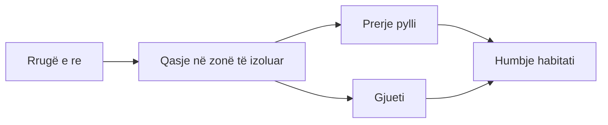

# Kërcënimet kryesore

Kërcënimet më të shpeshta ndaj natyrës në rajon, me atë që duhet kërkuar kur i dokumenton. Nuk është listë e plotë dhe nuk cakton përgjegjësi për raste konkrete.

| | Kërcënimi | Çfarë të kërkosh | Dëshmi e dobishme |
|:-:|---|---|---|
| :material-waves-arrow-right: | **Hidrocentrale dhe ndërhyrje në lumenj** | Diga, devijime, rrugë hyrëse në brigje | Fotografi, koordinata, leje mjedisore, imazhe satelitore para/pas |
| :material-excavator: | **Nxjerrje inertesh nga shtrati** | Makineri në shtrat, brigje të gërryera | Foto me datë, video, vendndodhje, ndryshimi i shtratit |
| :material-tree-outline: | **Prerje pylli e paligjshme** | Trungje të prera, rrugë të reja, kamionë | Foto, vendndodhje, [Global Forest Watch](https://www.globalforestwatch.org) |
| :material-home-alert-outline: | **Ndërtim në zona të mbrojtura ose bregdet** | Themele, ndërtesa pa tabelë lejeje | Foto, koordinata, kufiri i zonës, leje ndërtimi |
| :material-target: | **Gjueti dhe kurthe** | Kurthe, kapsolla, kafshë të ngordhura | Foto, koordinata; njofto inspektoratin, mos ndërhy vetë |
| :material-trash-can-outline: | **Ndotje dhe mbeturina** | Depozitime, ujëra të ndotura, djegie | Foto, mostra vetëm nga persona të trajnuar, data dhe ora |
| :material-fire: | **Zjarre** | Zjarre në pyje, kullota | [NASA FIRMS](https://firms.modaps.eosdis.nasa.gov), foto, vendndodhje |
| :material-sprout-outline: | **Specie pushtuese** | Bimë ose kafshë jo vendase në përhapje | Foto identifikuese, regjistrim në iNaturalist |
| :material-tent: | **Turizëm i pakontrolluar** | Kampe pa leje, mbeturina, dëmtim rrugësh | Foto, numri i vizitorëve, sezoni |
| :material-thermometer-alert: | **Ndryshimi i klimës** | Thatësira, ulje e ujit, zhvendosje e specieve | Seri kohore, të dhëna nga stacione ose satelitë |

## Kërcënimet lidhen me njëri-tjetrin

Rrallëherë një kërcënim vjen vetëm. Kur dokumenton, shënoji lidhjet mes tyre.

!!! tip "Hapi tjetër"
    Ke parë diçka nga kjo listë? Nis me [Dokumento një problem](../aktivizmi/dokumento.md).
