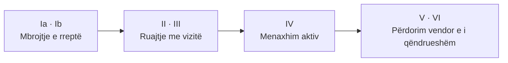

# Zonat e mbrojtura

Një **zonë e mbrojtur** është një hapësirë me kufij të përcaktuar që menaxhohet ligjërisht për ruajtjen afatgjatë të natyrës. Statusi përcakton çfarë lejohet dhe çfarë jo.

## Kategoritë IUCN

Shqipëria dhe Kosova i klasifikojnë zonat sipas sistemit të IUCN. Ligji shqiptar për zonat e mbrojtura (nr. 81/2017) i përafron kategoritë kombëtare me këtë sistem.

| Kategoria | Emri | Qëllimi kryesor |
|---|---|---|
| **Ia** | Rezervat i rreptë natyror | Mbrojtje e rreptë; qasje shumë e kufizuar, kryesisht për kërkim |
| **Ib** | Zonë e egër | Natyrë e paprekur, pa infrastrukturë të përhershme |
| **II** | Park kombëtar | Mbrojtja e ekosistemeve të mëdha, me vizitë dhe edukim |
| **III** | Monument natyre | Mbrojtja e një elementi të veçantë (shpellë, kaskadë, pemë) |
| **IV** | Zonë e menaxhuar për habitat/specie | Ndërhyrje aktive për një specie ose habitat |
| **V** | Peizazh i mbrojtur | Bashkëveprim i njeriut me natyrën me vlerë të veçantë |
| **VI** | Zonë e mbrojtur me burime të menaxhuara | Përdorim i qëndrueshëm i burimeve natyrore |

!!! tip "Pse ka rëndësi kategoria"
    Në një park kombëtar (II) ndërtimi dhe shfrytëzimi industrial kufizohen shumë; në një peizazh të mbrojtur (V) lejohen më shumë veprimtari vendore. Para se të thuash "kjo ndalohet", kontrollo kategorinë dhe **zonimin** e brendshëm të zonës.

## Shembuj

=== "Shqipëri"

    - **Thethi:** peizazh alpin, biodiversitet i lartë.
    - **Valbona:** lugina alpine dhe ekosistem malor.
    - **Llogaraja:** ndërthurje mal-det.
    - **Divjakë-Karavasta:** laguna dhe habitate të shpendëve.
    - **Butrinti:** trashëgimi kulturore dhe natyrore.
    - **Lumi i Egër i Vjosës** (2023): shpallur pas një fushate të gjatë, shih [rastin Vjosa](../../../lumi-vjosa/).

=== "Kosovë"

    - **Bjeshkët e Nemuna:** masiv malor me biodiversitet të pasur.
    - **Sharri:** ekosisteme alpine dhe kullota tradicionale.

## Rrjete ndërkombëtare

Një vend mund të jetë pjesë e disa rrjeteve njëkohësisht, me detyrime të ndryshme. Detajet janë te [Konventat & standardet](konventat.md).

-   :material-bird:{ .lg .middle } **Ramsar**

    Zona të lagështa me rëndësi ndërkombëtare.

-   :material-earth:{ .lg .middle } **UNESCO**

    Vende të Trashëgimisë Botërore, natyrore ose të përziera.

-   :material-star-four-points-outline:{ .lg .middle } **Emerald / Natura 2000**

    Rrjete habitatesh dhe specieve të mbrojtura në Evropë.

-   :material-map-marker-star-outline:{ .lg .middle } **KBA**

    Zona Kyçe të Biodiversitetit, identifikuar me kritere shkencore; **jo domosdoshmërisht të mbrojtura ligjërisht**.

## Nga statusi te zbatimi

Shpallja e një zone nuk garanton vetvetiu mbrojtjen e saj. Objektivat, zonimi, masat, buxheti dhe monitorimi duhet të lidhen në një plan që zbatohet dhe rishikohet. Shih [Menaxhimi i zonave dhe specieve](menaxhimi/index.md).

## Si të verifikosh statusin e një vendi

1. **Kërko zonën te [Protected Planet](https://www.protectedplanet.net)** për kategorinë dhe kufirin orientues.
2. **Kontrollo aktin ligjor** të shpalljes te [QBZ](https://qbz.gov.al) (Shqipëri) ose [Gazeta Zyrtare e Kosovës](https://gzk.rks-gov.net).
3. **Kërko planin e menaxhimit dhe zonimin** nga institucioni përgjegjës: [Kërko informacion publik](../aktivizmi/informim.md).
4. **Krahaso me [hartën e projektit](../../../map/).** Kufijtë atje vijnë nga OpenStreetMap dhe janë vetëm orientues.

## Burimet

- [IUCN: kategoritë e zonave të mbrojtura](https://www.iucn.org/theme/protected-areas/about/protected-area-categories)
- [Protected Planet (WDPA)](https://www.protectedplanet.net)
- [Key Biodiversity Areas](https://www.keybiodiversityareas.org)
