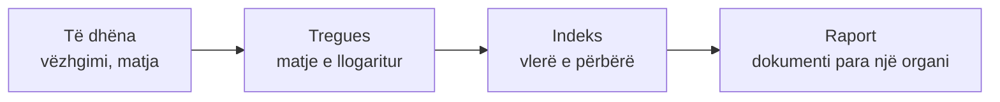

# Raportimi ndërkombëtar

Shtetet raportojnë rregullisht te konventat dhe organizmat ndërkombëtarë për gjendjen e natyrës, sipas **formateve, treguesve dhe indekseve të standardizuara**. Kjo pjesë ka dy shtresa: një **udhëzues praktik** për si të bëhesh vetë pjesë e këtij sistemi, dhe **referenca** për kuadrot, të dhënat, treguesit dhe indekset që e mbajnë.

[Fillo udhëzuesin](udhezuesi.md){ .md-button .md-button--primary }
[Shiko panelin e raporteve të projektit](../../dashboard/){ .md-button }

## Si lidhen të dhënat, treguesit dhe indekset

| Niveli | Çfarë është | Shembull |
|---|---|---|
| **Të dhëna** | Vëzhgimi ose matja bazë | Një vëzhgim specieje me datë dhe koordinata; kufiri i një zone të mbrojtur |
| **Tregues** | Matje e llogaritur nga të dhënat, me njësi dhe periudhë | Përqindja e tokës nën mbrojtje; sipërfaqja pyjore në hektarë |
| **Indeks** | Vlerë e përbërë që përmbledh shumë tregues ose specie | Indeksi i Listës së Kuqe (0 deri 1) |
| **Raport** | Dokumenti që i paraqet ato para një organi ose publiku, sipas një formati | Raporti kombëtar te Konventa për Diversitetin Biologjik |

Secili nivel varet nga ai më i ulët. Një indeks i mirë nuk zëvendëson të dhënat e mira, dhe një tregues pa burim e datë nuk verifikohet dot.

## Udhëzuesi

-   :material-map-marker-path:{ .lg .middle } **Si të raportosh ndërkombëtarisht**

    ---

    Hap pas hapi: zgjidh mekanizmin e duhur, mblidh dhe strukturo të dhënat, shkruaj kontributin dhe dërgoje.

    [:octicons-arrow-right-24: Fillo](udhezuesi.md)

-   :material-account-multiple-outline:{ .lg .middle } **Zgjidh profilin tënd**

    ---

    Mjetet që i furnizojnë të dhënat për këtë punë, sipas asaj që bën: vullnetar i ri, terren ose raportues.

    [:octicons-arrow-right-24: Shiko](profili/index.md)

## Referenca

Katër faqe përshkruese: çfarë ekziston, jo si të veprosh. Përdori kur shkruan kontributin nga udhëzuesi, ose kur lexon një raport zyrtar dhe do të dish çfarë kërkohej prej tij.

-   :material-file-document-outline:{ .lg .middle } **Kuadrot e raportimit**

    ---

    Kush raporton, te kush, sa shpesh dhe me çfarë formati.

    [:octicons-arrow-right-24: Shiko](kuadrot.md)

-   :material-database-check-outline:{ .lg .middle } **Të dhënat e nevojshme**

    ---

    Çfarë duhet mbledhur dhe si përshkruhet që të jetë e krahasueshme.

    [:octicons-arrow-right-24: Shiko](te-dhenat.md)

-   :material-chart-line:{ .lg .middle } **Treguesit**

    ---

    Treguesit e OZHQ-ve, të Kuadrit Global të Biodiversitetit, të BE-së dhe të Ramsarit.

    [:octicons-arrow-right-24: Shiko](treguesit.md)

-   :material-numeric:{ .lg .middle } **Indekset**

    ---

    Indekset e biodiversitetit, të ujit dhe të satelitëve, dhe kufizimet e tyre.

    [:octicons-arrow-right-24: Shiko](indekset.md)

## Për kë është

-   :material-book-search-outline:{ .lg .middle } **Lexuesit e raporteve**

    Duan të dinë çfarë matet dhe çfarë lihet jashtë.

-   :material-domain:{ .lg .middle } **OJQ-të dhe grupet vendore**

    Duan të dorëzojnë informacion plotësues, p.sh. një raport alternativ (*shadow report*), me të njëjtat terma.

-   :material-map-marker-path:{ .lg .middle } **Mbledhësit e të dhënave**

    Duan që puna e tyre të përdoret përtej një harte të vetme.

!!! note "Kufizim i rëndësishëm"
    Të dhënat e komunitetit **plotësojnë** ato zyrtare, nuk i zëvendësojnë. Një tregues zyrtar kërkon metodë të dokumentuar dhe shpesh kampionim shkencor. Thuaj qartë çfarë mbulon puna jote dhe çfarë jo.

!!! warning "Afatet dhe treguesit ndryshojnë"
    Ciklet e raportimit, listat e treguesve dhe versionet e formularëve azhurnohen. Kontrollo gjithmonë faqen e sekretariatit para se të referohesh te një afat ose numër treguesi. Për statusin e Kosovës te konventat, shih [Konventat & standardet](../baza/konventat.md).

## Burimet

- [Kuadri Global i Biodiversitetit Kunming-Montreal (CBD)](https://www.cbd.int/gbf)
- [UN SDG Indicators](https://unstats.un.org/sdgs/indicators/indicators-list/)
- [European Environment Agency](https://www.eea.europa.eu)
