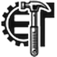

# Verifikim & arkivim

Për të provuar që një foto, video ose dokument është i vërtetë dhe për ta ruajtur para se të zhduket. Pjesë e profilit [Raportuesi](index.md).

*Versioni i parë: shtator 2026*

**Ç'kërkojmë:** metodë e **përsëritshme** nga të tjerët; mjeti nuk ndryshon origjinalin; ruan **metadata** dhe kohën e ruajtjes; kod i hapur kur ekziston alternativë e besueshme.

<div class="ib-tool-card" markdown>

### {: .ib-tool-logo }ExifTool

<span class="ib-pill">falas</span> <span class="ib-pill">kod i hapur</span> · [exiftool.org](https://exiftool.org)

Lexon dhe pastron metadatat e fotove (data, GPS, pajisja). **Lexo** ato para se të verifikosh; **fshiji** ato para publikimit kur vendndodhja duhet mbrojtur.

```bash
exiftool foto.jpg                        # shiko metadatat
exiftool -all= -o publike.jpg foto.jpg   # kopje publike pa metadata
```

</div>

<div class="ib-tool-card" markdown>

### {: .ib-tool-logo }SunCalc

<span class="ib-pill">falas</span> · [suncalc.org](https://www.suncalc.org)

Kontrollon nëse hijet dhe ora e diellit në një foto përputhen me datën e deklaruar.

</div>

<div class="ib-tool-card" markdown>

### {: .ib-tool-logo }InVID-WeVerify

<span class="ib-pill">shtesë shfletuesi</span> <span class="ib-pill">falas</span> <span class="ib-pill">kod i hapur</span> · [invid-project.eu](https://www.invid-project.eu/tools-and-services/invid-verification-plugin/)

Analizë e videove dhe e fotove (kuadro, kërkim invers i imazhit, metadata). Doli nga një projekt kërkimor i financuar nga BE-ja; kodi është publik ([GitHub](https://github.com/AFP-Medialab/InVID-plugin)).

</div>

<div class="ib-tool-card" markdown>

### Kërkim invers i imazhit

<span class="ib-pill ib-pill--warn">kod jo i hapur</span>

Google Lens, TinEye, Bing Visual Search: kontrollon nëse një foto është përdorur më parë. Përdori disa mjete, jo vetëm një.

!!! note "Kompromis i pranuar"
    Sot s'ka mjet me kod të hapur që bën kërkim invers imazhesh në shkallë të gjerë (kërkon indeksim të gjithë uebit). Deri sa të ketë një, përdorim disa shërbime të mbyllura së bashku, pa u mbështetur te vetëm njëri.

</div>

<div class="ib-tool-card" markdown>

### {: .ib-tool-logo }Wayback Machine

<span class="ib-pill">falas</span> · [web.archive.org](https://web.archive.org)

Arkivon faqet publike (njoftimet e institucioneve, VNM, njoftime tenderi) para se të ndryshojnë ose hiqen. Ruaj lidhjen e arkivit dhe datën.

</div>

<div class="ib-tool-card" markdown>

### {: .ib-tool-logo }Wikimedia Commons

<span class="ib-pill">falas</span> · [commons.wikimedia.org](https://commons.wikimedia.org)

Ruan fotografi me licencë të lirë në mënyrë të qëndrueshme dhe i lidh me Wikipedia/Wikidata. Vetëm për foto që ke të drejtë t'i licencosh dhe që nuk rrezikojnë specie ose njerëz.

</div>

Rregullat e verifikimit dhe paketa minimale e dëshmisë: [Praktikat](praktikat.md#kater-rregulla).
