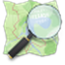

# Hartëzim & mbledhje

Mjete për të vizatuar kufij, mbledhur pika në terren dhe analizuar hapësirën. Pjesë e profilit [Puna në terren](index.md).

*Versioni i parë: shtator 2026*

### {: .ib-tool-logo }QGIS

falas kod i hapur (GPL) · [qgis.org](https://qgis.org)

Programi kryesor i hapur GIS për desktop. Krijon, redakton dhe analizon kufij, shtresa dhe harta të kërcënimeve. Eksporton në GeoJSON për [hartën e projektit](../../../../../map/).

### {: .ib-tool-logo }QField

falas kod i hapur offline · [qfield.org](https://qfield.org)

Përdor projektet QGIS në celular për mbledhje të dhënash në terren. Mirë për ekipe monitorimi.

### {: .ib-tool-logo }OpenStreetMap

të dhëna të hapura (ODbL) · [openstreetmap.org](https://www.openstreetmap.org)

Harta e hapur e botës. Kufijtë e zonave të mbrojtura, rrugët dhe ujërat mund të përmirësohen nga kushdo. Përdor **[Overpass Turbo](https://overpass-turbo.eu)** për të kërkuar dhe eksportuar të dhëna.

!!! warning "Rregull"
    Shto në OSM vetëm atë që e njeh direkt ose e verifikon nga burime të lejuara. Mos kopjo nga harta me licencë të kufizuar.

### {: .ib-tool-logo }{: .ib-tool-logo }Organic Maps dhe OsmAnd

aplikacione offline kod i hapur · [organicmaps.app](https://organicmaps.app) · [osmand.net](https://osmand.net)

Navigim offline me të dhënat e OSM; të dobishme për shtigje malore dhe zona pa lidhje.

### {: .ib-tool-logo }{: .ib-tool-logo }KoboToolbox dhe ODK

falas offline kod i hapur · [kobotoolbox.org](https://www.kobotoolbox.org) · [getodk.org](https://getodk.org)

Formularë për mbledhjen e të dhënave në terren (anketa, lista kontrolli, raporte incidentesh), me foto e GPS. Zgjidh ato kur disa vullnetarë duhet të plotësojnë të njëjtin format.

Rrjedha e propozuar për të kaluar nga këto mjete te harta: [Praktikat](praktikat.md#rrjedha-e-propozuar).

## Burimet

- [Dokumentacioni i QGIS](https://docs.qgis.org)
- [Mësoni OSM](https://learnosm.org)
