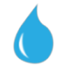
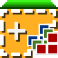

# Satelitë & monitorim

Për të parë ndryshimet në terren nga larg: prerje pylli, zjarre, ndërtim, ndryshim të ujërave. Pjesë e profilit [Puna në terren](index.md).

*Versioni i parë: shtator 2026*

**Ç'kërkojmë:** të dhëna të hapura ose falas për përdorim jo-komercial; metodë e dokumentuar dhe seri kohore të krahasueshme; rezolucion i mjaftueshëm për ndryshime lokale (10 m ose më mirë); përparësi ndaj mjeteve me kod të hapur, sidomos për analizë që duhet të mbetet e përsëritshme afatgjatë.

### {: .ib-tool-logo }Copernicus Browser dhe EO Browser

falas të dhëna të hapura · [browser.dataspace.copernicus.eu](https://browser.dataspace.copernicus.eu) · [apps.sentinel-hub.com/eo-browser](https://apps.sentinel-hub.com/eo-browser/)

Imazhe **Sentinel-2** (rezolucion 10 m, rreth çdo 5 ditë), nën politikën e Copernicus për **të dhëna të hapura, të plota dhe falas**. Krahaso data para/pas, shiko NDVI (bimësia) dhe shkarko shkallën e ndryshimit. Mjeti bazë për shtretërit e lumenjve, prerjet dhe ndërtimet e mëdha.

### {: .ib-tool-logo }Global Forest Watch

falas të dhëna të hapura (CC-BY) · [globalforestwatch.org](https://www.globalforestwatch.org)

Humbja e mbulesës së pemëve, sinjalizime prerjesh dhe zjarresh, kufij zonash të mbrojtura. Kërkon interpretim: humbja e pemëve përfshin edhe prerjet e ligjshme dhe kultivimin.

### {: .ib-tool-logo }NASA FIRMS

falas të dhëna publike · [firms.modaps.eosdis.nasa.gov](https://firms.modaps.eosdis.nasa.gov)

Zbulon zjarre aktive pothuajse në kohë reale. Sinjalizimet janë orientuese (piksele termike), jo konfirmim zjarri.

### {: .ib-tool-logo }JRC Global Surface Water

falas të dhëna të hapura · [global-surface-water.appspot.com](https://global-surface-water.appspot.com)

Hartë e ndryshimeve të sipërfaqes së ujit që nga 1984; e dobishme për liqene, laguna dhe shtretër lumenjsh.

### {: .ib-tool-logo }Google Earth Engine

falas për kërkim dhe OJQ jo-fitimprurëse jo e hapur · [earthengine.google.com](https://earthengine.google.com)

Analizë e fuqishme e serive kohore për ata që dinë programim. Varësia nga një kompani e vetme është kompromis: ruaj rezultatet dhe metodën jashtë platformës. Nëse ky kompromis nuk pranohet, shih alternativat me kod të hapur më poshtë.

### {: .ib-tool-logo }SNAP dhe QGIS

falas kod i hapur offline · [step.esa.int/main/toolboxes/snap](https://step.esa.int/main/toolboxes/snap/) · [qgis.org](https://qgis.org)

Alternativë me kod të hapur ndaj Google Earth Engine, pa varësi nga një kompani e vetme. **SNAP** (*Sentinel Application Platform*), i zhvilluar nga ESA, përpunon dhe analizon imazhe Sentinel lokalisht: NDVI, krahasim datash, klasifikim. **[QGIS](hartezim.md#qgis)**, i rekomanduar te hartëzimi, lexon të njëjtat produkte dhe, me shtesën **Semi-Automatic Classification Plugin** më poshtë, bën zbulim ndryshimesh dhe klasifikim mbulese toke. Më i ngadaltë për seri shumë të mëdha, por rezultatet dhe metoda mbeten plotësisht nën kontrollin tënd dhe të ripërsëritshme nga dikush tjetër.

### {: .ib-tool-logo }SentinelHub (plugin)

falas kod i hapur · [plugins.qgis.org/plugins/SentinelHub](https://plugins.qgis.org/plugins/SentinelHub/)

Shtesë QGIS që shkarkon imazhe Sentinel-1/2/3 direkt nga Copernicus Data Space brenda QGIS, pa dalë te shfletuesi. Kërkon llogari falas te Copernicus Data Space Ecosystem. E dobishme kur harta dhe imazhi duhet të jenë në të njëjtin program.

### {: .ib-tool-logo }Semi-Automatic Classification Plugin (SCP)

falas kod i hapur · [plugins.qgis.org/plugins/SemiAutomaticClassificationPlugin](https://plugins.qgis.org/plugins/SemiAutomaticClassificationPlugin/)

Klasifikim i mbikëqyrur i imazheve satelitore brenda QGIS: shkarkon, përpunon dhe klasifikon Sentinel/Landsat, dhe zbulon ndryshime mes dy datave. Shtesa më e votuar e QGIS për fushën; plotëson SNAP kur puna mbetet brenda QGIS.

Si të dokumentosh një ndryshim me satelit, hap pas hapi: [Praktikat](praktikat.md#si-te-dokumentosh-nje-ndryshim-me-satelit).

## Burimet

- [Copernicus Data Space](https://dataspace.copernicus.eu)
- [Sentinel-2 (ESA)](https://sentiwiki.copernicus.eu)
- [SNAP: dokumentacioni i ESA](https://step.esa.int/main/doc/tutorials/)
