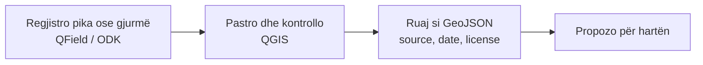

# Praktikat

Një ditë shembull, rrjedha e propozuar dhe si të dokumentosh një ndryshim me satelit. Pjesë e profilit [Puna në terren](index.md); mjetet e përmendura këtu janë te [Hartëzim & mbledhje](hartezim.md), [Shtesa të QGIS](shtesa-qgis.md) dhe [Satelitë & monitorim](monitorim.md).

*Versioni i parë: shtator 2026*

## Shembull: një ditë terreni

Verifikim i një sinjalizimi për prerje pylli, nga zyra deri te harta:

| Ora | Veprimi | Mjeti |
|---|---|---|
| 07:30 | Përgatit projektin QGIS me shtresat e ditës dhe e dërgoj te celulari | [QGIS](hartezim.md#qgis) + [QFieldSync](shtesa-qgis.md#qfieldsync) |
| 08:00 | Nisem drejt zonës; navigoj pa lidhje internet | [Organic Maps](hartezim.md#organic-maps-dhe-osmand) |
| 09:00–13:00 | Regjistroj kufirin e prerjes dhe pika GPS në terren | [QField](hartezim.md#qfield) |
| 13:30 | Plotësoj një formular incidenti me foto dhe orë | [KoboToolbox](hartezim.md#kobotoolbox-dhe-odk) |
| 15:00 | Kthehem në zyrë; sinkronizoj pikat e mbledhura në QGIS | [QFieldSync](shtesa-qgis.md#qfieldsync) |
| 15:30 | Krahasoj Sentinel-2 para/pas mbi zonën e prerjes | [SentinelHub (plugin)](monitorim.md#sentinelhub-plugin) brenda QGIS |
| 16:15 | Nxjerr vlerën NDVI te pikat e mbledhura, si dëshmi shtesë | [Point Sampling Tool](shtesa-qgis.md#point-sampling-tool) |
| 16:45 | Bashkoj shtresat e ekipit dhe pastroj atributet | [mmqgis](shtesa-qgis.md#mmqgis) |
| 17:00 | Eksportoj GeoJSON me burim, datë dhe licencë, dhe e propozoj për hartën | [Rrjedha e propozuar](#rrjedha-e-propozuar) |

Dita mbyllet me një shtresë të gatshme, jo me një përfundim ligjor: shih [Ndryshim nuk do të thotë shkelje](#si-te-dokumentosh-nje-ndryshim-me-satelit).

## Rrjedha e propozuar

Hapi i fundit: [Shto të dhëna në hartë](../../../rreth/kontribuo.md#shto-te-dhena-ne-harte). Shtesa QGIS që lehtësojnë këtë rrjedhë: [Shtesa (plugins) të QGIS](shtesa-qgis.md).

## Si të dokumentosh një ndryshim me satelit

1. **Zgjidh të njëjtin sezon** në të dy datat (bimësia ndryshon nga stina).
2. **Zgjidh imazhe pa re** mbi zonë.
3. **Ruaj captura** me datë dhe koordinata, plus emrin e produktit (p.sh. `Sentinel-2 L2A`).
4. **Shëno kufizimin:** 10 m nuk tregon një prerje të vogël ose një pemë të vetme.
5. **Kombino me foto nga terreni** kur është e mundur.

!!! warning "Ndryshim nuk do të thotë shkelje"
    Imazhet satelitore tregojnë **ndryshim**, jo **ligjshmëri**. Një ndryshim mund të ketë leje; kontrollo lejet e lëshuara para se të pretendosh shkelje.

## Siguria në terren

Mos shko vetëm në vende të izoluara, lajmëro dikë për itinerarin, dhe pastro metadatat e GPS-it para publikimit kur vendndodhja duhet mbrojtur. Lista e plotë: [Siguria dixhitale](../../siguria.md) dhe [Siguria e aktivistëve](../../../aktivizmi/siguria.md).

## Hapi tjetër

Kur të dhënat janë mbledhur dhe verifikuar, kalo te [Raportuesi](../raportuesi/index.md) për t'i kthyer në një dosje ose kontribut.
