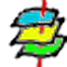
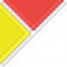

# Shtesa (plugins) të QGIS

QGIS vetë zgjerohet me shtesa falas dhe me kod të hapur, të instalueshme nga brenda programit (*Plugins → Manage and Install Plugins*). Këto lidhin drejtpërdrejt [hartëzimin desktop](hartezim.md) me terrenin, me të dhënat e hapura dhe me [satelitët](monitorim.md), pa shtuar varësi të mbyllura. Pjesë e profilit [Puna në terren](index.md).

*Versioni i parë: shtator 2026*

### {: .ib-tool-logo }QuickMapServices (QMS)

falas kod i hapur · [plugins.qgis.org/plugins/quick_map_services](https://plugins.qgis.org/plugins/quick_map_services/)

Shton shpejt shtresa sfondi (OSM, satelitore) brenda QGIS, si referencë vizuale kur dixhitalizon kufij ose kontrollon vendndodhje. Vetëm sfond; jo burim për pretendime.

### {: .ib-tool-logo }QuickOSM

falas kod i hapur · [plugins.qgis.org/plugins/QuickOSM](https://plugins.qgis.org/plugins/QuickOSM/)

Bën pyetje Overpass dhe importon të dhëna të OpenStreetMap direkt si shtresa QGIS (p.sh. të gjitha zonat e mbrojtura ose ujërat e një rajoni), pa dalë te [Overpass Turbo](https://overpass-turbo.eu) në shfletues.

### {: .ib-tool-logo }QFieldSync

falas kod i hapur · [plugins.qgis.org/plugins/qfieldsync](https://plugins.qgis.org/plugins/qfieldsync/)

Përgatit dhe sinkronizon një projekt QGIS me **QField**: përcakton çfarë shtresash shkojnë në terren, në ç'format, dhe rikthen pikat e mbledhura në projektin desktop. Ura mes hartëzimit në zyrë dhe mbledhjes në terren, e gjitha me kod të hapur.

### {: .ib-tool-logo }Point Sampling Tool

falas kod i hapur · [plugins.qgis.org/plugins/pointsamplingtool](https://plugins.qgis.org/plugins/pointsamplingtool/)

Nxjerr vlerat e një rrasteri (p.sh. NDVI ose një indeks uji nga [Satelitë & monitorim](monitorim.md)) te pikat e vëzhgimit që ke mbledhur në terren, si kolona të reja atributesh. Lidh dëshminë e terrenit me matjen satelitore, gati për t'u përdorur si [tregues](../../treguesit.md).

### {: .ib-tool-logo }CKAN-Browser

falas kod i hapur · [plugins.qgis.org/plugins/CKANBrowser](https://plugins.qgis.org/plugins/CKANBrowser/)

Shfleton dhe ngarkon direkt në QGIS grupe të dhënash nga portale të hapura ndërtuar mbi **CKAN** — softueri që përdorin shumë portale zyrtare hapash të hapura. E dobishme kur një institucion publikon të dhëna hapësinore përmes një portali të tillë.

### mmqgis

falas kod i hapur · [plugins.qgis.org/plugins/mmqgis](https://plugins.qgis.org/plugins/mmqgis/)

Grup veglash për pastrimin e të dhënave: bashkon shtresa nga disa vullnetarë ose eksporte QField/ODK, bën *geocoding*, bashkon atribute dhe eksporton në CSV/KML. E dobishme mes hapit "mblidh" dhe hapit "propozo për hartën" në [rrjedhën e hartëzimit](praktikat.md#rrjedha-e-propozuar).

## Burimet

- [Depoja e shtesave të QGIS](https://plugins.qgis.org)
- [Dokumentacioni i QFieldSync](https://docs.qfield.org/how-to/synchronize/)
