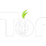

# Siguria dixhitale

Mbrojtësit e mjedisit përballen me presion, përgjim dhe ndonjëherë me kërcënime. Këto mjete ulin rrezikun; nuk e eliminojnë. Të përbashkëta për të tria [profilet](profili/index.md). Për sigurinë e plotë: [Siguria e aktivistëve](../aktivizmi/siguria.md).

*Versioni i parë: shtator 2026*

## Zgjidh shpejt

| Dua të… | Përdor |
|---|---|
| Shkruaj dhe telefonoj të enkriptuar | [Signal](#signal) |
| Kam server të vetin për organizatën | [Element (Matrix)](#element-matrix) |
| Menaxhoj fjalëkalimet | [Bitwarden](#bitwarden) |
| Enkriptoj dosjet e dëshmisë | [Cryptomator / VeraCrypt](#cryptomator-dhe-veracrypt) |
| Ruaj anonimitetin e një burimi | [Tor / OnionShare](#tor-browser-dhe-onionshare) |

**Ç'kërkojmë:** kod i hapur ose auditime të pavarura; enkriptim skaj-më-skaj; metadata minimale, pa numër telefoni kur ka alternativë; mirëmbajtje aktive.

## Mjetet

### {: .ib-tool-logo }Signal

falas kod i hapur · [signal.org](https://signal.org)

Mesazhe dhe thirrje të enkriptuara skaj-më-skaj. Aktivizo **mesazhet që zhduken** për grupet e ndjeshme dhe **kyçjen e ekranit**. Kërkon numër telefoni; përdor një **emër përdoruesi** dhe fshih numrin nga kontaktet.

### {: .ib-tool-logo }Element (Matrix)

kod i hapur · [element.io](https://element.io)

Alternativë e federuar e mesazheve të enkriptuara për organizata që duan serverin e vet.

### {: .ib-tool-logo }Bitwarden

falas kod i hapur · [bitwarden.com](https://bitwarden.com)

Menaxher fjalëkalimesh. Çdo llogari me fjalëkalim unik dhe **verifikim me dy hapa**. Aktivizo hyrjen me çelës fizik ose aplikacion autentikimi, jo SMS.

### {: .ib-tool-logo }{: .ib-tool-logo }Cryptomator dhe VeraCrypt

falas kod i hapur · [cryptomator.org](https://cryptomator.org) · [veracrypt.io](https://veracrypt.io)

Enkriptim i dosjeve të dëshmisë, sidomos kur ruhen në cloud (Cryptomator) ose në disqe të jashtëm (VeraCrypt).

### {: .ib-tool-logo }{: .ib-tool-logo }Tor Browser dhe OnionShare

falas kod i hapur · [torproject.org](https://www.torproject.org) · [onionshare.org](https://onionshare.org)

Tor fsheh vendndodhjen tënde gjatë shfletimit; OnionShare dërgon skedarë pa ndërmjetës. Përdori kur burimi duhet të mbetet anonim.

## Minimumi për çdo organizatë

- [ ] Fjalëkalime unike me menaxher, dhe verifikim me dy hapa.
- [ ] Përditësime automatike të pajisjeve.
- [ ] Kyçje e ekranit dhe enkriptim i disqeve.
- [ ] Kopje rezervë e enkriptuar e dëshmive.
- [ ] Një plan: kush qaset te çka, dhe çfarë bëhet nëse një pajisje humbet.

## Burimet

- [Security in a Box](https://securityinabox.org): udhëzues për aktivistë
- [Access Now Digital Security Helpline](https://www.accessnow.org/help/): ndihmë e drejtpërdrejtë për organizata të shoqërisë civile
