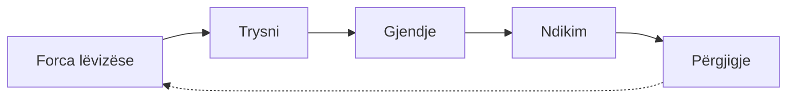

# Treguesit

Një **tregues** është një matje e përcaktuar qartë që mund të përsëritet me kalimin e kohës: ka njësi, burim të dhënash, periudhë dhe, shpesh, objektiv. Raportet ndërkombëtare mbështeten në lista të miratuara treguesish, që shtetet i plotësojnë me të dhëna kombëtare.

## Çfarë e bën një tregues të mirë

-   :material-target:{ .lg .middle } **Përkatës**

    Lidhet me atë që duam të dimë?

-   :material-ruler:{ .lg .middle } **I matshëm**

    Ka njësi dhe metodë të qartë?

-   :material-pulse:{ .lg .middle } **I ndjeshëm**

    Ndryshon kur ndryshon gjendja e natyrës?

-   :material-compare-horizontal:{ .lg .middle } **I krahasueshëm**

    Krahasohet në kohë dhe mes vendeve?

-   :material-database-clock-outline:{ .lg .middle } **Me burim të vazhdueshëm**

    Kush do t'i mbledhë të dhënat vitin tjetër?

## Renditja sipas DPSIR

Agjencia Evropiane e Mjedisit i grupon treguesit sipas zinxhirit shkak-pasojë-përgjigje. Ndihmon që një raport të mos ngatërrojë çfarë po ndodh me çfarë po bëhet.

| Grupi | Pyetja | Shembuj |
|---|---|---|
| **Forca lëvizëse** | Pse ndodh? | Rritja e kërkesës për energji, turizëm, ndërtim |
| **Trysni** | Çfarë i bëhet natyrës? | Sipërfaqja e prerë, ujë i nxjerrë, ndotje e hedhur |
| **Gjendje** | Si është natyra? | Gjendja ekologjike e lumit, popullatat e specieve |
| **Ndikim** | Çfarë humbet? | Zhdukja e specieve, humbja e shërbimeve të ekosistemit |
| **Përgjigje** | Çfarë po bëhet? | Zona të reja të mbrojtura, plane menaxhimi, gjoba |

## Treguesit kryesorë ndërkombëtarë

=== "OZHQ (SDG)"

    | Treguesi | Çfarë mat |
    |---|---|
    | **15.1.1** | Sipërfaqja pyjore si pjesë e sipërfaqes totale |
    | **15.1.2** | Pjesa e vendeve të rëndësishme për biodiversitetin tokësor dhe të ujërave të ëmbla që mbulohen nga zona të mbrojtura |
    | **15.3.1** | Pjesa e tokës së degraduar |
    | **15.5.1** | Indeksi i Listës së Kuqe |
    | **6.3.2** | Pjesa e trupave ujorë me cilësi të mirë |
    | **6.6.1** | Ndryshimi në shtrirjen e ekosistemeve të lidhura me ujin |
    | **14.5.1** | Mbulimi i zonave detare nga zona të mbrojtura |
    | **11.4.1** | Shpenzimet për ruajtjen e trashëgimisë kulturore dhe natyrore për frymë |

=== "Kuadri Global i Biodiversitetit"

    Kuadri ka **tregues kryesorë (*headline*)**, **të përbërë** dhe **plotësues**. Shembuj:

    | Objektivi | Treguesi kryesor |
    |---|---|
    | **1** | Përqindja e tokës dhe detit nën planifikim hapësinor që merr parasysh biodiversitetin |
    | **2** | Sipërfaqja nën restaurim |
    | **3** | Mbulimi nga zona të mbrojtura dhe masa të tjera efektive të ruajtjes (OECM) |
    | **4** | Indeksi i Listës së Kuqe |
    | **6** | Shpejtësia e vendosjes së specieve pushtuese |

    Lista e plotë dhe metodologjitë: [sekretariati i CBD](https://www.cbd.int/gbf).

=== "Zonat e mbrojtura"

    | Treguesi | Çfarë mat |
    |---|---|
    | **Mbulimi** | Pjesa e territorit ose e detit nën mbrojtje ligjore |
    | **Përfaqësimi** | A mbrohen të gjitha llojet e ekosistemeve, jo vetëm ato më të lehtat |
    | **Lidhshmëria (ProtConn)** | Sa të lidhura janë zonat mes tyre |
    | **Efektshmëria e menaxhimit** | Rezultati i vlerësimeve si METT ose RAPPAM |
    | **Ekuiteti dhe qeverisja** | Kush vendos dhe kush përfiton |

    !!! tip "Sasia nuk është cilësi"
        Një vend mund të arrijë përqindjen e synuar të zonave të mbrojtura dhe prapë të mos i menaxhojë ato. Kërko gjithmonë edhe treguesin e efektshmërisë, jo vetëm mbulimin.

=== "UNESCO dhe Ramsar"

    | Kuadri | Çfarë vlerësohet |
    |---|---|
    | **UNESCO** | Ruajtja e OUV, integriteti, mbrojtja dhe menaxhimi; IUCN i klasifikon sitet në *Të mira*, *Të mira me disa shqetësime*, *Me shqetësim të konsiderueshëm*, *Kritike* |
    | **Ramsar** | Ndryshimet në karakterin ekologjik të sitit; siti mund të futet në **Regjistrin Montreux** nëse ka ndryshime të pafavorshme |

=== "Kuadri evropian"

    | Treguesi | Çfarë mat |
    |---|---|
    | **Statusi i ruajtjes (Neni 17)** | Shtrirja, popullata, habitati dhe perspektivat e habitateve dhe specieve |
    | **Gjendja ekologjike dhe kimike (Direktiva Kuadër e Ujërave)** | Klasa e trupave ujorë |
    | **Treguesit e përbashkët të EEA** | Seri të harmonizuara për ajrin, ujin, tokën dhe biodiversitetin |

## Si t'i afrohesh me të dhënat e tua

| Treguesi | Si mund t'i afrohesh | Kufizimi |
|---|---|---|
| Humbja e mbulesës pyjore në një zonë | [Global Forest Watch](https://www.globalforestwatch.org) me kufirin e zonës | Përfshin edhe prerjet e ligjshme |
| Ndryshimi i shtratit të lumit | [JRC Global Surface Water](https://global-surface-water.appspot.com), Sentinel-2 | Tregon ndryshim, jo ligjshmëri |
| Numri i specieve të vëzhguara | GBIF, iNaturalist | Pasqyron përpjekjen e vëzhgimit, jo bollëkun |
| Zjarre aktive | [NASA FIRMS](https://firms.modaps.eosdis.nasa.gov) | Sinjalizime orientuese |

Për metodën: [Satelitë & monitorim](../rekomandime/monitorim.md).

!!! warning "Mos e paraqit si tregues zyrtar"
    Kur llogarit diçka vetë, shëno që është **vlerësim i komunitetit**, me metodën, burimin dhe kufizimet. Treguesit zyrtarë kanë metodologji të miratuar.

## Burimet

- [UN SDG Indicators](https://unstats.un.org/sdgs/indicators/indicators-list/)
- [CBD: Monitoring Framework](https://www.cbd.int/gbf)
- [Protected Planet Report](https://www.protectedplanet.net/en/resources)
- [EEA: Indicators](https://www.eea.europa.eu)
- [IUCN Green List](https://iucngreenlist.org) · [METT](https://www.protectedplanet.net)
