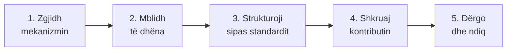

# Si të raportosh ndërkombëtarisht

Ky udhëzues është për t'u bërë pjesë e sistemit **ndërkombëtar** të raportimit: si të kontribuosh, kontestosh ose plotësosh atë që shteti raporton te konventat dhe organizmat ndërkombëtarë. Për një incident konkret në terren (prerje, ndërtim pa leje, ndotje), rruga e parë mbetet ankesa te institucioni vendas: [Raporto te institucionet](../aktivizmi/raporto.md).

<div class="ib-glance">
<div><strong>Për kë</strong>OJQ, grupe vendore dhe kushdo me të dhëna ose dëshmi të verifikuara</div>
<div><strong>Të duhet</strong>Të dhëna me metodë të qartë, njohje e mekanizmit të duhur</div>
<div><strong>Del</strong>Kontribut, dosje ose komunikim i dërguar te trupi kompetent</div>
</div>

## Pesë hapat



### 1. Zgjidh mekanizmin e duhur

Jo çdo çështje shkon te i njëjti vend. Krahaso situatën tënde:

| Situata jote | Mekanizmi | Ku e dërgon |
|---|---|---|
| Dua të kontribuoj në strategjinë/raportin kombëtar të biodiversitetit | Konsultim publik për **NBSAP** ose raportin kombëtar të CBD-së | Ministria e mjedisit; [cbd.int/nbsap](https://www.cbd.int/nbsap) |
| Një sit Ramsar po degradohet dhe fleta e tij (RIS) është e vjetruar | Kërkesë për përditësim ose regjistrim në **Regjistrin Montreux** | Autoriteti administrativ Ramsar i vendit → [Sekretariati Ramsar](https://www.ramsar.org) |
| Një sit i Trashëgimisë Botërore është nën kërcënim | Informacion për **gjendjen e ruajtjes** (*state of conservation*) | [Qendra e Trashëgimisë Botërore UNESCO](https://whc.unesco.org); kopjo edhe IUCN si organ këshillimor |
| Habitat ose specie e mbrojtur nga Konventa e Bernës është në rrezik | **Dosje** (*file*) drejtuar Komitetit të Përhershëm | [Sekretariati i Konventës së Bernës](https://www.coe.int/en/web/bern-convention) |
| Institucioni refuzoi informacion mjedisor ose pjesëmarrje | Komunikim te **Komiteti i Pajtueshmërisë** së Aarhusit | [UNECE Aarhus](https://unece.org/environmental-policy/public-participation/aarhus-convention/about) — vetëm pasi ke shterur rrugën vendase, shih [Kërko informacion publik](../aktivizmi/informim.md) |
| Do të kontestosh vlerësimin e BE-së për kapitullin e mjedisit | Kontribut për shoqërinë civile në raportin e vendit / *screening* | Delegacioni i BE-së në vend; ministria përgjegjëse për integrimin |
| Çështja është një rast i vetëm, vendor (prerje, ndërtim, gjueti) | S'është rast për një mekanizëm ndërkombëtar | [Raporto te institucionet](../aktivizmi/raporto.md) |

Kuadrot e plota, me formatin dhe ritmin e secilit: [Kuadrot e raportimit](kuadrot.md).

!!! warning "Kontrollo gjithmonë procedurën aktuale"
    Kush mund të dërgojë, në ç'format dhe deri kur ndryshon me kohën dhe s'është gjithmonë e njëjtë për çdo mekanizëm. Faqja e sekretariatit e ka procedurën e saktë; ky udhëzues tregon **cilën derë të trokasësh**, jo formularin e saktë të ditës.

### 2. Mblidh të dhëna me metodë të qartë

Përdor mjetet sipas [profilit tënd](profili/index.md): [vëzhgim specieje](profili/fillestari/index.md), [hartëzim dhe satelitë](profili/terreni/index.md), [verifikim](profili/raportuesi/index.md). Çdo pikë duhet të ketë **datë, vendndodhje, burim dhe licencë**.

### 3. Strukturoji sipas standardit

Mekanizmat ndërkombëtarë presin fusha të njohura, jo tekst të lirë: [Darwin Core](te-dhenat.md#standardet-e-te-dhenave) për vëzhgime specieje, atributet e **WDPA** për zona të mbrojtura, metadata sipas **FAIR**. Shih [Të dhënat e nevojshme](te-dhenat.md) për listën e plotë.

### 4. Lidhe me një tregues, kur ka kuptim

Nëse pretendimi është matshëm (humbje pyjore, ndryshim i sipërfaqes së ujit, rënie popullate), citoje si **tregues**, jo si përshtypje: [Treguesit](treguesit.md) tregon cilët përdoren ndërkombëtarisht dhe si t'i afrohesh me të dhënat e tua.

!!! note "Nuk je vlerësim zyrtar"
    Shëno gjithmonë që është **kontribut i pavarur** ose **vlerësim i komunitetit**, me metodën dhe kufizimet. Kjo nuk e zvogëlon vlerën e tij — e bën të besueshëm.

### 5. Shkruaj kontributin dhe dërgoje

Modeli më poshtë përshtatet për cilindo nga mekanizmat e hapit 1: ndrysho vetën "MEKANIZMI" dhe destinacionin.

```text
Për:      [Sekretariati / pika fokale kombëtare]
Kopje:    [Ministria përgjegjëse; organizata partnere]
Lënda:    Kontribut i pavarur: [emri i sitit/çështjes] — [mekanizmi, p.sh. Konventa e Bernës]

Të nderuar,

1. KUSH JEMI
   [Organizata / grupi]. Kontakt: [email].

2. ÇFARË RAPORTOJMË
   Në lidhje me [siti/specia/habitati], nën [mekanizmin], kemi vëzhguar
   [përshkrim faktik në 2–3 fjali], mbështetur në të dhëna të mbledhura
   [periudha] sipas metodës [emri i mjetit/standardit].

3. TË DHËNAT (bashkëlidhur ose lidhje)
   - [Bashkëngjitje ose lidhje drejt datasetit, me licencë]
   - Metoda: [p.sh. iNaturalist + GBIF; Sentinel-2 NDVI; QField]

4. LIDHJA ME RAPORTIN ZYRTAR
   Sipas [raportit kombëtar / RIS-it / Nenit 17], gjendja deklarohet
   [citimi]. Të dhënat tona [e mbështesin / ndryshojnë nga] kjo, sepse [arsyeja].

5. KËRKESA
   Kërkojmë që [mekanizmi] të marrë parasysh këtë informacion kur
   [vlerëson gjendjen / përgatit raportin / shqyrton pajtueshmërinë].

Me respekt,
[Emri, organizata, kontakti]
```

### 6. Ndiq dhe regjistro

Ruaj çdo konfirmim marrjeje dhe datë. Ciklet e raportimit janë shpesh shumëvjeçare: shëno në kalendar kur pritet raporti tjetër dhe rikontrollo nëse kontributi u pasqyrua.

## Gabimet më të zakonshme

<div class="grid cards ib-compact" markdown>

-   :material-close-circle-outline:{ .lg .middle } **Mekanizmi i gabuar**

    Një ankesë vendore e dërguar te një sekretariat ndërkombëtar zakonisht nuk përparon; fillo nga [Raporto te institucionet](../aktivizmi/raporto.md).

-   :material-close-circle-outline:{ .lg .middle } **Pa metodë të dokumentuar**

    "E kemi parë" nuk mjafton; duhen datë, vendndodhje, burim.

-   :material-close-circle-outline:{ .lg .middle } **E paraqitur si zyrtare**

    Të dhënat e komunitetit plotësojnë raportin zyrtar; nuk e zëvendësojnë.

-   :material-close-circle-outline:{ .lg .middle } **Afati i humbur**

    Ciklet janë fikse; një kontribut pas afatit shpesh pret raundin tjetër.

</div>

## Burimet

- [CBD: NBSAP-të kombëtare](https://www.cbd.int/nbsap)
- [Ramsar: raportet kombëtare](https://www.ramsar.org)
- [UNESCO: raportimi periodik](https://whc.unesco.org/en/periodicreporting/)
- [Bern Convention](https://www.coe.int/en/web/bern-convention)
- [UNECE Aarhus](https://unece.org/environmental-policy/public-participation/aarhus-convention/about)
