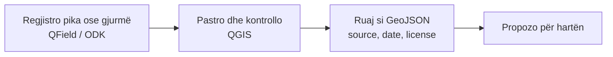

# Hartëzim & terren

Mjete për të vizatuar kufij, mbledhur pika në terren dhe analizuar hapësirën.

*Versioni i parë: shtator 2026*

## Zgjidh shpejt

| Dua të… | Përdor |
|---|---|
| Vizatoj kufij dhe analizoj shtresa në kompjuter | [QGIS](#qgis) |
| Mbledh pika në terren, offline | [QField](#qfield) ose [KoboToolbox / ODK](#kobotoolbox-dhe-odk) |
| Përmirësoj ose kërkoj në hartën e hapur | [OpenStreetMap](#openstreetmap) |
| Navigoj në mal pa lidhje | [Organic Maps / OsmAnd](#organic-maps-dhe-osmand) |

**Ç'kërkojmë:** formate të hapura (GeoJSON, GPX, GeoPackage); punë **offline** në terren; sistem koordinatash i qartë (**WGS84** për shkëmbim).

## Mjetet

### QGIS

falas kod i hapur (GPL) · [qgis.org](https://qgis.org)

Programi kryesor i hapur GIS për desktop. Krijon, redakton dhe analizon kufij, shtresa dhe harta të kërcënimeve. Eksporton në GeoJSON për [hartën e projektit](../../../map/).

### QField

falas kod i hapur offline · [qfield.org](https://qfield.org)

Përdor projektet QGIS në celular për mbledhje të dhënash në terren. Mirë për ekipe monitorimi.

### OpenStreetMap

të dhëna të hapura (ODbL) · [openstreetmap.org](https://www.openstreetmap.org)

Harta e hapur e botës. Kufijtë e zonave të mbrojtura, rrugët dhe ujërat mund të përmirësohen nga kushdo. Përdor **[Overpass Turbo](https://overpass-turbo.eu)** për të kërkuar dhe eksportuar të dhëna.

!!! warning "Rregull"
    Shto në OSM vetëm atë që e njeh direkt ose e verifikon nga burime të lejuara. Mos kopjo nga harta me licencë të kufizuar.

### Organic Maps dhe OsmAnd

aplikacione offline · [organicmaps.app](https://organicmaps.app) · [osmand.net](https://osmand.net)

Navigim offline me të dhënat e OSM; të dobishme për shtigje malore dhe zona pa lidhje.

### KoboToolbox dhe ODK

falas offline · [kobotoolbox.org](https://www.kobotoolbox.org) · [getodk.org](https://getodk.org)

Formularë për mbledhjen e të dhënave në terren (anketa, lista kontrolli, raporte incidentesh), me foto e GPS. Zgjidh ato kur disa vullnetarë duhet të plotësojnë të njëjtin format.

## Rrjedha e propozuar

Hapi i fundit: [Shto të dhëna në hartë](../rreth/kontribuo.md#shto-te-dhena-ne-harte).

## Burimet

- [Dokumentacioni i QGIS](https://docs.qgis.org)
- [Mësoni OSM](https://learnosm.org)
