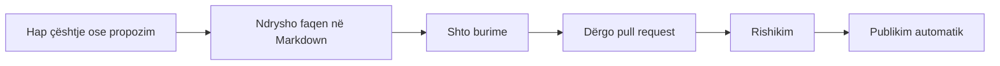

# Si të kontribuosh

Kjo Guide ka vlerë vetëm nëse përmirësohet nga njerëz të ndryshëm. Çdo kontribut, i vogël ose i madh, ndihmon.

## Mënyrat e kontributit

<div class="grid cards" markdown>

-   :material-pencil-outline:{ .lg .middle } **Korrigjo ose plotëso**

    Gjete një gabim, një ligj të vjetruar ose një burim që mungon? Përdor butonin e redaktimit në krye të faqes.

-   :material-map-marker-plus-outline:{ .lg .middle } **Shto të dhëna në hartë**

    Propozo zona, vëzhgime ose shënime me GeoJSON dhe burim të verifikuar.

    [:octicons-arrow-right-24: Udhëzimet](#shto-te-dhena-ne-harte)

-   :material-toolbox-outline:{ .lg .middle } **Propozo një mjet**

    Sugjero një mjet ose burim që përmbush [kriteret tona](../raportimi/profili/index.md).

-   :material-translate:{ .lg .middle } **Përkthe ose rishiko**

    Ndihmo me gjuhën, qartësinë dhe saktësinë e ligjeve dhe termave.

</div>

## Rrjedha e kontributit



Çdo pretendim faktik ka nevojë për lidhje ose referencë. Faqet ndodhen te `docs/`.

## Shto të dhëna në hartë

Qytetarët, ekspertët dhe organizatat mund të dokumentojnë natyrën dhe të ndajnë burime. Çdo kontribut shqyrtohet dhe publikohet me atribuim.

<div class="ib-steps" markdown>

1. **Përgatit vendndodhjen.** Përdor GeoJSON në WGS84: zonat si `Polygon` ose `MultiPolygon`, vëzhgimet e florës dhe faunës si `Point`. Mund të shtosh edhe një [shënim lokal në hartë](../../../map/?notes=1); ai mbetet në pajisjen tënde derisa ta dërgosh për shqyrtim.

2. **Shto përshkrimin dhe burimet.** Çdo objekt ka:

    - ID unike dhe emër;
    - përmbledhje të qartë;
    - kodin e vendit `AL` ose `XK`;
    - lidhjen, datën dhe llojin e burimit;
    - autorin dhe licencën për fotografitë.

3. **Dërgoje për shqyrtim.** Vendose objektin te skedari i grupit përkatës në `public/data/manual/` dhe [propozo ndryshimin në depon e projektit](https://github.com/pomodoren/heritage). Për statusin e zonave, ndërhyrjet dhe organizatat kontribuuese përdoret fleta e përbashkët e raportimit e projektit.

</div>

!!! warning "Burimi dhe atribuimi janë të detyrueshme"
    Çdo propozim tregon burimin, datën, licencën kur aplikohet dhe personin ose organizatën kontribuuese.

## Bashkëpuno me rrjetin

=== "Qytetar"

    Raporto një specie, ndryshim ose shqetësim dhe ruaj burimin përkatës.

=== "Ekspert"

    Prezanto fushën, zonën ku punon dhe mënyrën si mund të shqyrtosh ose pasurosh të dhënat.

=== "Organizatë"

    Paraqit projektet, zonat e punës dhe datasetet që mund të përdoren nga rrjeti.

Për të propozuar një profil ose organizatë, [hap një çështje në GitHub](https://github.com/pomodoren/heritage/issues). Profilet e publikuara gjenden te [Rrjeti](rrjeti.md).

## Standardet

<div class="grid cards ib-compact" markdown>

-   :material-check-circle-outline:{ .lg .middle } **Bëj**

    ---

    - Shkruaj **shqip të qartë**, me fjali të shkurtra.
    - Jep burim për çdo pretendim faktik.
    - Ndiq [metodologjinë](metodologjia.md) dhe [licencën](licenca.md).

-   :material-close-circle-outline:{ .lg .middle } **Mos bëj**

    ---

    - Mos shto lidhje reklamuese ose tregtare.
    - Mos shto vendndodhje të sakta të specieve të rrezikuara.
    - Mos shto të dhëna personale.

</div>

## Struktura e dokumenteve

| Seksioni | Dosja | Ç'përmban |
|---|---|---|
| Baza e njohurive | `docs/baza/` | Njohuri, kuadri, të dhëna |
| Raportimi | `docs/raportimi/` | Udhëzuesi, profilet (mjete), kuadro, tregues, indekse |
| Aktivizmi | `docs/aktivizmi/` | Procese, modele, raste |
| Rreth nesh | `docs/rreth/` | Misioni, metodologjia, kontributi |

## Ndërtimi lokal

```bash
python3 -m pip install -r requirements.txt
mkdocs serve
```

Dokumentacioni hapet te `http://127.0.0.1:8000/`.
